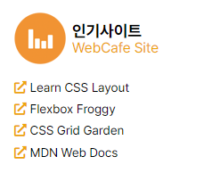

## 230615 목 회고

**인트로**  
회고조가 정해지고, 어떻게 회고를 잘 할 수 있을까 고민하다가, 회고 담당 로테이션을 만들었다. 로테이션을 돌면서 해당 요일은 그 사람이 회고를 맡아 진행하는 것이다. 당일 수업을 잘 듣고 설명할 수 있을 정도가 되어야 할 것이다.  
어떻게 하면 좋을까 하다가 수업을 들으면서 md 파일을 만들어보기로 했닥. 메인 페이지 마지막 단계여서 여러 태그들이 많이 나왔다.  
회고로서 수업 때 배운 개념들을 mdn 공식 문서에서 다시 보는 게 좋지 않을까 싶어서 각 교시 별 개념을 정리하고 공식 문서 링크를 달아보았다. 추가 자료 있으면 사이트와 블로그 링크까지 추가했다.

- [230615 목 회고](#230615-목-회고)
  - [1교시 : 게시물 마크업](#1교시--게시물-마크업)
  - [2교시 : 게시물 CSS](#2교시--게시물-css)
    - [white-space](#white-space)
    - [text-overflow](#text-overflow)
    - [flex](#flex)
  - [3교시 : 인기사이트 html, css](#3교시--인기사이트-html-css)
    - [data-tooltip](#data-tooltip)
    - [counter-increment](#counter-increment)
  - [4교시 : 트위터 마크업](#4교시--트위터-마크업)
  - [5교시 : 트위터 css](#5교시--트위터-css)
    - [inline-flex](#inline-flex)
    - [clamp](#clamp)
    - [object-fit](#object-fit)
    - [object-position](#object-position)
  - [6교시 : 푸터 html, css](#6교시--푸터-html-css)
    - [shape-outside](#shape-outside)
    - [shape-margin](#shape-margin)
    - [address](#address)
    - [small](#small)
  - [7교시 : SASS](#7교시--sass)
    - [sass 설치 페이지](#sass-설치-페이지)
    - [sass 인트로 강의](#sass-인트로-강의)


### 1교시 : 게시물 마크업

```html
  <ul class="board__list">
    <li class="board__item">
      <span
        class="far fa-dot-circle accentBoard"
        aria-hidden="true"
      ></span>
      <a href="" class="board__link"> HTML5 표준 명세서를 읽는 방법 </a>
      <time class="board__date" datetime="2023-06-15">2023-06-15</time>
    </li>
    <li class="board__item">
      <span
        class="far fa-dot-circle accentBoard"
        aria-hidden="true"
      ></span>
      <a href="" class="board__link">CSS를 활요한 애니메이션 </a>
      <time class="board__date" datetime="2023-06-15">2023-06-15</time>
    </li>
    <li class="board__item">
      <span
        class="far fa-dot-circle accentBoard"
        aria-hidden="true"
      ></span>
      <a href="" class="board__link"> 프론트엔드 프레임워크 전격 해부 </a>
      <time class="board__date" datetime="2023-06-15">2023-06-15</time>
    </li>
    <li class="board__item">
      <span
        class="far fa-dot-circle accentBoard"
        aria-hidden="true"
      ></span>
      <a href="" class="board__link">
        웹표준 그리고 정보 접근성에 대하여
      </a>
      <time class="board__date" datetime="2023-06-15">2023-06-15</time>
    </li>
    <li class="board__item">
      <span
        class="far fa-dot-circle accentBoard"
        aria-hidden="true"
      ></span>
      <a href="" class="board__link">
        웹카페 유튜브 라이브 참여는 오늘 자정까지 메일로 신청 가능
      </a>
      <time class="board__date" datetime="2023-06-15">2023-06-15</time>
    </li>
  </ul>
  <a href="/" title="게시판" class="board__more">
    <span class="far fa-plus-square accentBoard" aria-hidden="true">
    </span>
    더보기
  </a>
```

### 2교시 : 게시물 CSS
```css
/* 공통 게시판 */
.board {
  position: relative;
}


.board__list {
  padding-left: 0;
  list-style-type: none;
}


.board__item {
  display: flex;
  flex-flow: row nowrap;
  margin-top: var(--spacing-xs);
}


.board__date {
  width: 5.3125rem;
  text-align: right;
  flex-grow: 1;
  flex-shrink: 0;
}


.board__link {
  width: calc(100% - 6rem);
  /* flex-grow: 1; */
  white-space: nowrap;
  overflow: hidden;
  text-overflow: ellipsis;
}


.board__more {
  position: absolute;
  top: 0;
  right: 0;
}
```
#### [white-space][white-space]
#### [text-overflow][text-overflow]
#### [flex][flex]


### 3교시 : 인기사이트 html, css

```css
/* 공통 인기사이트 */
.favorite__list {
  list-style-type: none;
  padding: 0;
}


.favorite__item {
  margin-top: var(--spacing-xs);
}


.favorite__link {
  display: block;
  position: relative;
}


.favorite__link:hover::after {
  content: attr(data-tooltip);
  position: absolute;
  top: 0.5em;
  margin-left: 1em;
  color: #fff;
  background-color: #000;
  padding: 0.5em;
  border-radius: 5px;
  font-size: var(--spacing-sm);
}
```
#### [data-tooltip][data-tooltip]
#### [counter-increment][counter-increment]

### 4교시 : 트위터 마크업

```html
  <div class="twitter__container">
    <dl class="twitter__userInfo">
      <dt class="a11yHidden">사용자 이름</dt>
      <dd class="twitter__userName">김데레사</dd>
      <dt class="a11yHidden">사용자 아이디</dt>
      <dd class="twitter__userId">
        <a href="" class="accentTwitter">@seulbinim</a>
      </dd>
    </dl>
    <figure class="twitter__userProfile">
      
    </figure>
    <p class="twitter__summary">
      웹표준 핵심 가이드북 개정판 출시 기념으로 세미나를 준비했습니다.
      참석을 원하시는 분들은 페이스북과 트위터 그리고 유튜브 채널을 통해
      문의주시기 바랍니다.
    </p>
    <div class="twitter__date">
      <span class="far fa-clock accentTwitter"></span>
      <time class="twitter__date" datetime="2023-06-08">일주일전</time>
    </div>
  </div>
```

### 5교시 : 트위터 css
#### [inline-flex][inline-flex]
#### [clamp][clamp]
#### [object-fit][object-fit]
#### [object-position][object-position]


### 6교시 : 푸터 html, css

```html
    <footer class="appFooter">
      <address class="address">
        <span>서울 서초구 사평대로53길 30 반포엠 203호</span>
        <span>이메일: seulbinim@gmail.com</span>
      </address>
      <small class="copyright">
        Copyright since 2010 &copy; by Web Cafe CORPORATION ALL RIGHTS RESERVED
      </small>
    </footer>
```

```css
/* 공통 푸터 */
.appFooter {
  background-color: var(--primary-color);
  color: var(--white);
  padding: var(--spacing-xl);
  display: flex;
  flex-flow: column nowrap;
  gap: var(--spacing-base);
}

.address {
  font-style: normal;
}

.copyright {
  font-size: 100%;
}

  /* 데스크탑 푸터 */
  .appFooter {
    align-items: center;
  }

  /* 모바일 푸터 */
  .address {
    display: flex;
    flex-flow: column nowrap;
  }
```
#### [shape-outside][shape-outside]
#### [shape-margin][shape-margin]
#### [address][address]
#### [small][small]


### 7교시 : SASS
```
mkdir sass-test
cd sass-test
touch test.scss

<!-- test.scss에 입력 -->
$test: yellow;

body {
  background: $test;
}

<!-- scss 변환 -->
sass test.scss style.css
<!-- 오류(command not found)날 경우 npx sass test.scss style.css-->

npm install live-server
npm install npm-run-all
<!-- package.json 파일에서 이름과 버전 뜨는지 확인 -->
```
#### [sass 설치 페이지][sass-설치-페이지]
#### [sass 인트로 강의][sass-인트로-강의]

[white-space]: https://developer.mozilla.org/ko/docs/Web/CSS/white-space
[text-overflow]: https://developer.mozilla.org/en-US/docs/Web/CSS/text-overflow
[flex]: https://css-tricks.com/snippets/css/a-guide-to-flexbox/
[data-]: https://developer.mozilla.org/ko/docs/Learn/HTML/Howto/Use_data_attributes
[data-tooltip]: https://programmingsummaries.tistory.com/369
[counter-increment]: https://developer.mozilla.org/ko/docs/Web/CSS/CSS_counter_styles/Using_CSS_counters
[inline-flex]: https://www.inflearn.com/questions/71058/%EC%84%A0%EC%83%9D%EB%8B%98-css%EC%9D%98-display-inline-flex%EA%B4%80%EB%A0%A8-%EC%A7%88%EB%AC%B8%EC%9E%85%EB%8B%88%EB%8B%A4
[clamp]: https://developer.mozilla.org/en-US/docs/Web/CSS/clamp
[object-fit]: https://developer.mozilla.org/ko/docs/Web/CSS/object-fit
[object-position]: https://developer.mozilla.org/ko/docs/Web/CSS/object-position
[shape-outside]: https://developer.mozilla.org/en-US/docs/Web/CSS/shape-outside
[shape-margin]: https://developer.mozilla.org/en-US/docs/Web/CSS/shape-margin
[address]: https://developer.mozilla.org/ko/docs/Web/HTML/Element/address
[small]: https://developer.mozilla.org/ko/docs/Web/HTML/Element/small
[sass-설치-페이지]: https://www.npmjs.com/package/sass
[sass-인트로-강의]: https://www.youtube.com/watch?v=XGRGwixMb6s