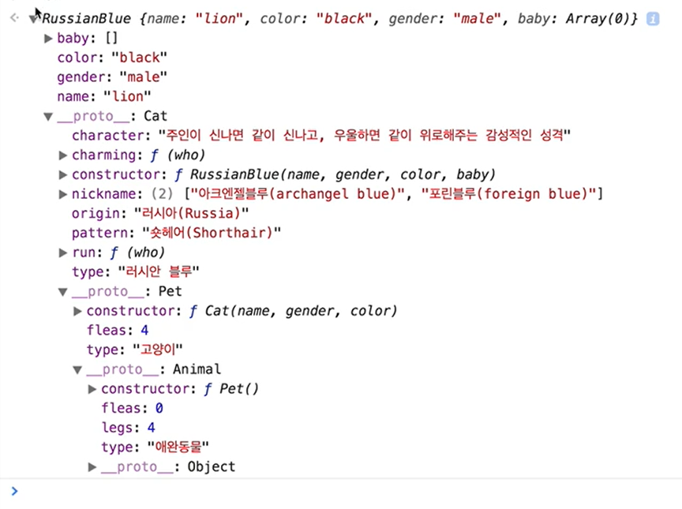

# 인터랙션 디자인(JavaScript)

- [인터랙션 디자인(JavaScript)](#인터랙션-디자인javascript)
  - [객체 / 상속](#객체--상속)
  - [생성자 / 프로토타입](#생성자--프로토타입)
  - [객체 지향 프로그래밍](#객체-지향-프로그래밍)
  - [객체 지향 프로그래밍 용어 풀이](#객체-지향-프로그래밍-용어-풀이)
  - [함수형 vs 객체 지향 프로그래밍](#함수형-vs-객체-지향-프로그래밍)
  - [DOM API - 문서 프로그래밍 인터페이스](#dom-api---문서-프로그래밍-인터페이스)


## 객체 / 상속
JavaScript의 모든 객체는 Object 자손.

```js
//객체 생성 : {} , new Object();
var o = {};
//속성 추가
o.name = '객체';
//속성 삭제
delete o.name;

//속성을 객체가 소유했는지 여부 확인  
//'property' in object
'name' in o;

//객체 순환  
//for in
```


객체 병합 : Mixin
```js
var mixin = function() {
  var mixin_obj = {};
  for(var i = 0; l = arguments.length; i < l; i++) {
    var o = arguments[i];
    for(var key in o) {
      var value = o[key];
      if(o.hasOwnProperty(key)) {
        mixin_obj[key] = value;
      }
    }
  }
}

var car = { /*  */ };
var extended_car_features = { /*  */ };
var super_car = mixin(car, extended_car_features);
```

- 객체 속성 정의
  - 객체 및 속성을 갖는 새 객체를 만듦
  - Object.create(객체명);
- 객체에 직접 새로운 속성을 정의하거나 이미 존재하는 객체를 수정한 뒤 그 객체를 반환
  - Object.defineProperty(obj, property, descriptor)
  - writable: false, //할당 연산자를 통한 값 변경 가능 여부
  - enumerable: false, //객체의 속성으로 열거 가능 여부
  - configurable: false, //객체의 속성 제거 가능 여부
  - value: undefined //객체 속성 값 설정

```js
Object.defineProperty(o, 'use', {
  value: 'office',
  writable: true,
});
```

- 데이터 접근 기술
  - getter : 속성의 값을 얻는 목적으로 사용. 함수 반환 값이 객체 속성 값이 됨(get: undefined)
  - value, get을 동시에 사용하면 오류 발생.
  - setter : 속성의 값을 설정하기 위한 함수. 오직 하나의 인자만 받음. 속성 값으로 할당(set: undefined)

```js
(function() {
  var visible = true;
  Object.defineProperty(o, 'visible', {
    get: function() {console.log('getter')}; return visible;
    set: function(value) {console.log('setter')}; visible = value;
  })
})();

o.visible //getter true
o.visible = false //setter false
```

- Object.defineProperties(obj, props)
  - 이미 존재하거나 새로운 프로퍼티들의 각종 속성들을 재정의할 수 있음
```js
(function() {
  var pad = 0;
  Object.defineProperties(o, {
    margin: {
      value: '외부 여백'
    },
  padding: {
    get: function() { return pad; },
    set: function(value) { pad = value; }
  })  
})();
```
- 객체 확장 차단
  - 새로운 속성을 추가하지 못함(지우는 것은 가능)
  - Object.preventExtensions(객체명);
  - Object.isExtensible(객체명) // 확장 가능 여부 확인
- 객체 밀봉(Sealing)
  - 새로운 속성 추가할 수 없고, 모든 속성을 설정 불가능 상태로 만들어줌
  - 쓰기 가능한 속성(Writable)의 값은 밀봉 후에도 변경 가능
  - Object.seal(객체명);
  - Object.isSealed(객체명)
- 객체 동결(Freezing)
  - 객체의 속성을 지우거나 바꿀 수 없음
  - 밀봉 + 속성 값 변경 차단
  - Object.freeze(객체명);
  - Object.isFrozen(객체명);
- Object 객체의 인스턴스 메서드
  - .hasOwnProperty() 메서드 // 본인 속성인지 확인 - true, false

## 생성자 / 프로토타입
- 객체는 생성자 함수를 통해 생성  
new 연산자 뒤에 생성자 함수 실행하면, 내장 객체 또는 사용자 정의 객체 인스턴스를 생성

1. 함수를 작성하여 객체 타입을 정의
   1. 첫 글자를 대문자로 작성해, 일반 함수와 구분(String(), Number(), Array())
   2. 모든 함수 객체는 정의와 동시에 자동으로 함수의 프로토타입 객체를 참조하는 속성 가지게 됨(객체명.prototype, Array.prototype)
2. new 연산자로 객체 인스턴스 생성
   1. .prototype을 상속하는 새로운 객체가 하나 생성됨
   2. 이 객체에 바인드된 this와 함께 생성자 함수가 호출됨
   3. 생성된 객체는 함수의 결과물로 반환됨(return 기본값 === return this)

ES6부터는 class 문법 사용 가능

```js
var tab1 = new Tab();
tab1.constructor === Tab;
tab1 instanceof Tab;
```

```js
//생성자 함수에 연결되어 있는 prototype 객체에 접근하는 법
body_tab.constructor.prototype;
body_tab.__proto__;
Object.getPrototypeOf(body_tab);
```
- 생성자 함수는 객체를 생성하는 모체 역할 수행
- prototype 객체는 생성자를 통해 생성된 모든 객체가 공통으로 상속하는 속성/메서드 집합
- 생성자는 전달 인자를 통해 객체 고유의 속성을 설정할 수 있음

## 객체 지향 프로그래밍



```js
function inherit(subClass, superClass) {
  subClass.prototype = Object.create(superClass.prototype);
  subClass.prototype.constructor = subClass;
}
```


```js
// -------------------------------------------------------------------------
// JavaScript 객체 지향 프로그래밍(OOP, Object Oriented Programming) & 상속
// -------------------------------------------------------------------------

// 각 객체를 생성하는 생성자 함수를 만들고, 
// 공통적인 부분을 생성자 함수의 프로토타입 객체에 설정하는 것.

(function(){
  'use strict';
  /**
   * @constructor: Animal
   * 생성자 함수: `동물`
   */
  function Animal() {
    'use strcit';
  }

  // @prototype: Animal
  // 프로토타입 객체: `동물`
  Animal.prototype.type  = '동물';
  Animal.prototype.brain = true;
  Animal.prototype.legs  = 0;
  Animal.prototype.run   = function(){};

  /**
   * @constructor: Pet
   * 생성자 함수: `애완동물`
   */
  function Pet() {
    'use strcit';
  }

  // @prototype: Pet
  // 프로토타입 객체: `애완동물`
  Pet.prototype.type  = '애완동물';
  Pet.prototype.brain = true;
  Pet.prototype.legs  = 4;
  Pet.prototype.fleas = 0;
  Pet.prototype.run   = function(){};

  /**
   * @constructor: Cat
   * 생성자 함수: `고양이`
   */
  function Cat(name, gender, color) {
    'use strcit';
    this.name   = name;
    this.color  = color;
    this.gender = gender;
  }

  // @prototype: Cat
  // 프로토타입 객체: `고양이`
  Cat.prototype.type   = '고양이';
  Cat.prototype.brain = true;
  Cat.prototype.legs  = 4;
  Cat.prototype.fleas = 4;
  Cat.prototype.run    = function(){};
  
}());

// 즉, Animal이 가진 속성/메서드는 Cat이 모두 가진다는 것.
// `상속`을 활용해 효율적으로 관리할 수 있음

(function() {
  'use strict';
  
  /**
   * @constructor: Animal
   * 생성자 함수: `동물`
   */
  function Animal() {
    'use strcit';
  }

  // @prototype: Animal
  // 프로토타입 객체: `동물`
  Animal.prototype.type  = '동물';
  Animal.prototype.brain = true;
  Animal.prototype.legs  = 0;
  Animal.prototype.run   = function(){ return this.type + ' 달리다'; };

  /**
   * @constructor: Pet
   * 생성자 함수: `애완동물`
   */
  function Pet() {
    'use strcit';
  }

  // @inheritance: Pet ⇐ Animal
  // 상속: `동물`의 속성/메서드를 `애완동물`에게
  // Pet.prototype = Object.create(Animal.prototype);
  // Pet.prototype.constructor = Pet;

  // 헬퍼함수
  function inherit(sub_class, super_class) {
    try {
      sub_class.prototype = Object.create(super_class.prototype);
      sub_class.prototype.constructor = sub_class;
    } catch(e) {
      console.error(e.message); 
    }
  }

  // Pet ⇐ Animal 상속
  inherit(Pet, Animal);
  
  // @prototype: Pet
  // 프로토타입 객체: `애완동물`
  Pet.prototype.type  = '애완동물';
  Pet.prototype.legs  = 4;
  Pet.prototype.fleas = 0;

  /**
   * @constructor: Cat
   * 생성자 함수: `고양이`
   */
  function Cat(name, gender, color) {
    'use strcit';
    this.name   = name;
    this.color  = color;
    this.gender = gender;
  }
  
  // Cat ⇐ Pet 상속
  inherit(Cat, Pet);

  // @prototype: Cat
  // 프로토타입 객체: `고양이`
  Cat.prototype.type  = '고양이';
  Cat.prototype.fleas = 4;
  
})();

// 캡슐화(Encapsulation)? 즉시 실행 함수식(IIFE) 패턴
// IIFE 패턴을 사용해 생성자 함수와 상속, 프로토타입 객체를 한데 묶어 관리
```

## 객체 지향 프로그래밍 용어 풀이

대표적인 객체 지향 프로그래밍 언어 : JavaScript, Java, C#, Ruby, Python, Objective-C.  
1. 객체 지향 프로그래밍은 추상화(Abstraction)를 사용하여 모델을 만드는 프로그래밍. 
2. 모듈성, 다형성 및 캡슐화를 포함한 여러 기술을 사용. 
3. OOP에서 각 객체는 메시지를 수신하고 데이터를 처리하며 메시지를 다른 객체로 보낼 수 있음
4. 각 개체는 별개의 역할이나 책임이 있는 독립적인 작은 컴퓨터로 볼 수 있음 
5. 객체 지향 프로그래밍은 프로그래밍의 유연성과 유지 보수성을 높이기 위한 것.

- 특징
- Class -객체 속성(Properties)을 정의합니다. ( 예: 설계 도면 )
- Object - Class의 인스턴스(Instance) 입니다. ( 예: 설계 도면을 통해 구현된 실제 제품 )
- Property - 객체의 속성을 말합니다. ( 예: color 등과 같은 명사 형태 )
- Method - 객체의 기능을 말합니다.( 예: walk() 등과 같은 동사 형태 )
- Constructor - 인스턴스 생성 순간에 호출 실행되는 메서드입니다.
- Inheritance - Class는 다른 Class로 부터 속성들을 상속받을 수 있습니다. (Super Class ⇒ Sub Class)
- Encapsulation - Class는 해당 객체의 속성, 메서드 만 정의할 수 있습니다. (외부 접근 불가)
- Abtsraction - 복잡한 상속, 메서드, 객체 속성의 결합은 반드시 현실 모델을 시뮬레이션할 수 있어야 합니다.
- Polymorphism - 다른 Class 들이 같은 메서드나 속성으로 정의될 수 있습니다.

## 함수형 vs 객체 지향 프로그래밍

```js
// -------------------------------------------------------------------------
// JavaScript 함수형 프로그래밍  VS  객체 지향 프로그래밍
// DOM 스크립팅을 목표로 하는 프로그래밍 패러다임 별 사용법을 알아봅시다.
// -------------------------------------------------------------------------

// <함수형 프로그래밍>
(function(global, document) {
  'use strict';
  
  var namespace = 'y9';
  
  function el(selector, context) {
    return (context || document).querySelector(selector);
  }
  function els(selector, context) {
    return (context || document).querySelectorAll(selector);
  }
  function each(list, callback) {
    for (var i=0, l=list.length; i<l; i++) { callback(list[i], i); }
  }
  function on(el, type, handler) {
    el.addEventListener(type, handler);
  }
  function off(el, type, handler) {
    el.removeEventListener(type, handler);
  }
  function hasClass(el, name) {
    return el.classList.contains(name);
  }
  function addClass(el, name) {
    var names = name.split(' ');
    each(names, function(name){ el.classList.add(name); });
    return el;
  }
  function removeClass(el, name) {
    name ? el.classList.remove(name) : (el.className = '');
    return el;
  }  
  function toggleClass(el, name) {
    return hasClass(el, name) ? removeClass(el, name) : addClass(el, name);
  }
  
  Object.defineProperty(global, namespace, { value: {} });
  
  [
    // 내보낼 함수를 추가
    el, els, 
    on, off, 
    hasClass, addClass, removeClass, toggleClass,
    each,
  ]
  .forEach(function(fn){
    global[namespace][fn.name] = fn;
  });

  Object.freeze(global[namespace]);
  
})(window, document);

// -------------------------------------------------------------------------

// <객체 지향 프로그래밍>
(function(global, document){

  // @constructor
  function Dom(selector, context){
    try {
      if (typeof selector === 'string') {
        var _els = (document || selector).querySelectorAll(selector);
        var i = 0, l = _els.length;
        for (; i<l; ++i) { this[i] = _els[i]; }
        this.length = l;
      } else if (selector && selector.nodeType === 1) {
        this[0] = selector;
        this.length = 1;
      } else {
        this.length = 0;
      }
    } catch(e) {
      console.error(e.message);
    }
  }
  
  // @static__methods
  Dom.each = function(list, callback) {
    var count = list.length;
    for (var i=0; i<count; i++) { callback(list[i], i); }
  };
  
  // @prototype
  // @instance__methods
  (function(){
    this.version = '0.0.1';
    this.each = function(callback) {
      Dom.each(this, callback);
    };
    this.on = function(type, handler) {
      Dom.each(this, function(item, i) {
        item.addEventListener(type, handler.bind(item, item, i));
      });
    };
    this.hasClass = function(name) {
      return this[0].classList.contains(name);
    };
    this.addClass = function(name) {
      var names = name.split(' ');
      Dom.each(this, function(item, i) {
        Dom.each(names, function(name) {
          item.classList.add(name);
        });
      });
      return this;
    };
    this.removeClass = function(name) {
      Dom.each(this, function(item, i) {
        name ? item.classList.remove(name) : item.className = '';
      });
      return this;
    };
    this.toggleClass = function(name) {
      Dom.each(this, function(item, i) {
        if (item.classList.contains(name)) {
          item.classList.remove(name);
        } else {
          item.classList.add(name);
        }
      });
      return this;
    };
    this.eq = function(index) {
      return new Dom(this[index]);
    };
  }).call(Dom.prototype);
  
  // 공개
  Object.defineProperty(global, 'Dom', { 
    value: function(selector, context) {
      return new Dom(selector, context);
    }
  });

  Object.freeze(global.Dom);
  
}(window, document));
```

## DOM API - 문서 프로그래밍 인터페이스

HTML, XML 문서를 오브젝트로 추상화하여 이들을 다루는 방법이 정의되어 있음.

DOM(Document Object Model) 선택 API 메서드
- getElementById()
- getElementsByTagName()
- getElementsByClassName()
- querySelector()
- querySelectorAll()
- matches()

Node(Element 상위 개념) 속성 - element, text 포함
- childNodes - 직계 자식만 가져옴
  - children - 직계 요소 자식만 가져옴
- firstChild
  - firstElementChild
- lastChild
  - lastElementChild
- nextSibling
  - nextElementSibling
- previousSibling
  - previousElementSibling
- parentNode
- nodeType
- nodeName
- nodeValue(텍스트 노드에 접근해 string 가져오고 싶을 때는 textContent 사용 권장)