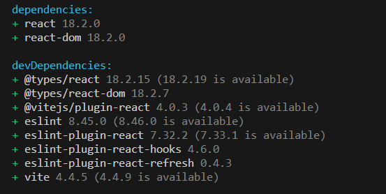

# 테킷 멋쟁이사자처럼 React

- [테킷 멋쟁이사자처럼 React](#테킷-멋쟁이사자처럼-react)
  - [React](#react)
    - [키워드](#키워드)
- [1교시](#1교시)
- [2교시](#2교시)
- [3교시](#3교시)
- [4교시](#4교시)
- [5,6교시](#56교시)

## React

-[React 공식 문서][] 읽기

- React는 프레임워크가 아닌 라이브러리
- Next.js는 리액트를 위해 만든 오픈소스 자바스크립트 웹 프레임워크

- React를 쓰는 이유 : 마크업 제너레이션

pnpm create vite learn-react
=> react
=> JavaScript



[React 공식 문서]: https://react.dev/learn

### 키워드

- import
- export, export default
- JSX
- component
- return ()
- 형제 요소 <>, <React.fragment>, <div>
- property 전달
- {}
- 절대 경로 설정

# 1교시

버튼 컨트롤러 컴포넌트 분리
각 버튼 컴포너트 구분 - direction, label로 스크롤 다운, 업 구분

# 2교시

figma 컴포넌트 만들기

# 3교시

리스트 렌더링

- 역순
- 객체 key, value 순환

# 4교시

이벤트 핸들링
pointerenter(마우스, 펜, 터치)
rest props

# 5,6교시

CSS module

pnpm tailwind 설치

```
pnpm add -D tailwindcss postcss autoprefixer postcss-import
pnpm tailwindcss init -p
```

pocketbase
https://pocketbase.io/

introduction에서
파일 다운로드 후
압축 풀고
프로젝트 폴더에 위치

    "pocketbase": "./pocketbase/pocketbase serve"

pockethost
https://pockethost.io/
